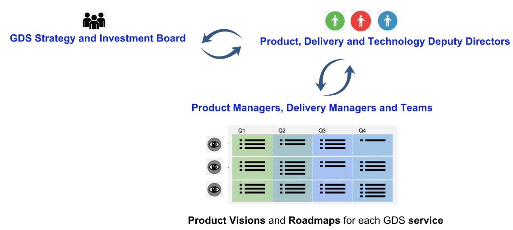
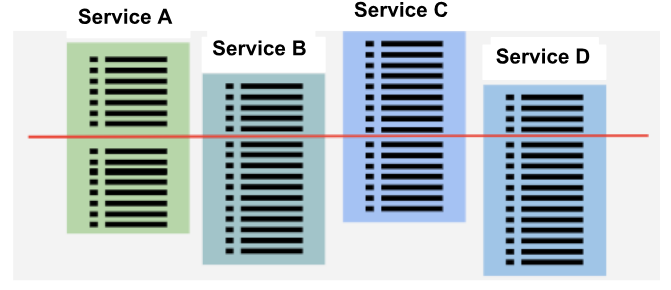

# <%= current_page.data.title %>

GDS teams plan roadmaps for the year ahead and deliver in 3 month cycles. A team’s work for a quarter is called a ‘mission’ and described by [Objectives and key results (OKRs)](https://en.wikipedia.org/wiki/OKR).

For each quarter the planning process defines:

- mission priorities
- which missions happen
- forecast benefits
- dependencies
- team sizes and who works where

[GDS teams work in an agile way](https://gds.blog.gov.uk/2018/04/26/gov-uk-a-journey-in-scaling-agile/) and release on demand. Missions finish at the end of each quarter and there’s no assumption a piece of work will necessarily continue into the next quarter.

## Product roadmaps

GDS creates product visions and roadmaps for each service for the year ahead, prioritising high value work.

GDS product roadmap cycle:

Roadmaps can include:

- new features
- business as usual (BAU) work to support a service
- work to fix defects
- explorative work, like discoveries
- enhancements to efficiency, like adopting DevOps tooling
- discovery or alpha work
- resolving technical debt

The Service Manual has [more information about roadmaps](https://www.gov.uk/service-manual/agile-delivery/developing-a-roadmap).

## Prioritisation

The quarterly planning process defines what teams work on during a quarter, including the size and makeup of the teams doing the work.

Example service prioritisation:

Inputs into prioritisation include:

- BAU ‘lights on’ work
- people and skills availability
- departmental and programme commitments

Quarterly planning takes into account:

- new approved work
- risk management
- dependencies
- GDS strategy
- GDS external commitments

People express preferences to move product areas using a survey along with conversations in [GDS communities of practice](https://sites.google.com/a/digital.cabinet-office.gov.uk/gds/communities-of-practice). These results help decide who moves each quarter due to changes in product priorities and which work and team sizes continue into the next quarter.

The GDS Strategy and Investment board signs off each quarter’s scope, expressed as a list of missions prioritised using the [MoSCoW method](https://en.wikipedia.org/wiki/MoSCoW_method).

Potential missions can come from many sources, for example service teams, programme directors or deputy directors.

## Further reading

Read more about the concepts behind quarterly planning:

- [The GDS planning cycle](https://sites.google.com/a/digital.cabinet-office.gov.uk/gds/we-are-gds/enabling-portfolio/quarterly-planning-cycle-for-gds) - information about the GDS quarterly planning cycle
- [Developing a roadmap](https://www.gov.uk/service-manual/agile-delivery/developing-a-roadmap) - showing how a product or service may develop over time
- [Mission Command](https://hbr.org/2010/11/mission-command-an-organizat) - Harvard Business Review
- [The Art of Action](http://www.stephenbungay.com/Books.ink) - Stephen Bungay
- [MoSCoW method](https://en.wikipedia.org/wiki/MoSCoW_method) - must have, should have, could have, and will not have

## Contact

For more information contact the Quarterly Planning team by:

- emailing [quarterly-missions-team@digital.cabinet-office.gov.uk](mailto:quarterly-missions-team@digital.cabinet-office.gov.uk)
- subscribing to [sprint notes](https://groups.google.com/a/digital.cabinet-office.gov.uk/forum/?hl=en-GB#!forum/quarterly-planning)
- using the [GDS Planning Cycle Wiki](https://sites.google.com/a/digital.cabinet-office.gov.uk/gds/we-are-gds/enabling-portfolio/quarterly-planning-cycle-for-gds)
